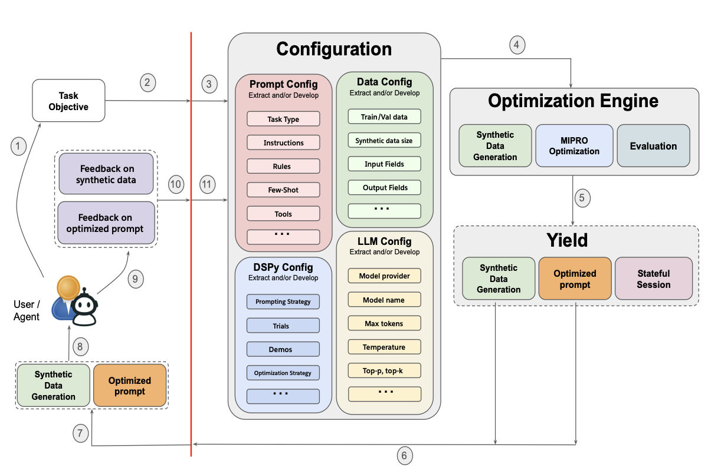

# Promptomatix

## Overview
Promptomatix is an AI-driven framework for automating and optimizing large language model (LLM) prompts. It provides a structured, cost-effective, and high-quality approach to prompt engineering, leveraging DSPy and advanced optimization techniques. Ideal for both researchers and developers.

## Key Features
- Zero-configuration intelligence: automatic task analysis and prompt setup
- Automated synthetic data generation for training and testing
- Task-specific optimization and metrics
- Real-time human feedback integration
- Comprehensive session management and logging
- Framework-agnostic: supports OpenAI, Anthropic, Cohere, and more
- Flexible CLI and Python API interfaces

## Architecture

  

- **Input Processing**: Analyzes user input and task requirements
- **Synthetic Data Generation**: Creates tailored datasets
- **Optimization Engine**: Iteratively improves prompts
- **Evaluation System**: Assesses performance with task-specific metrics
- **Feedback Integration**: Incorporates human feedback
- **Session Management**: Tracks progress and logs 